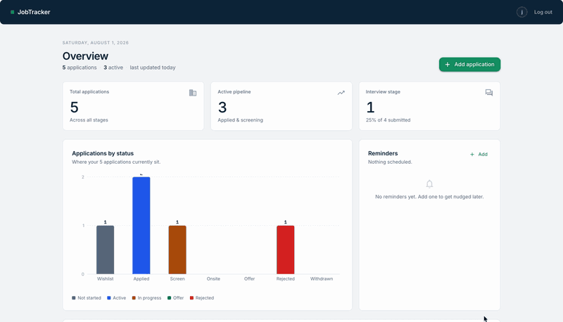
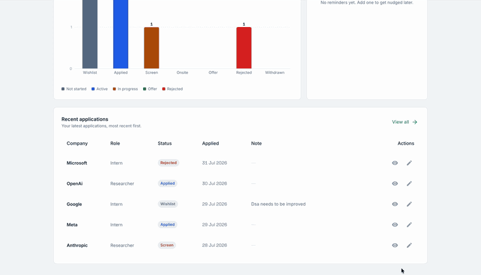
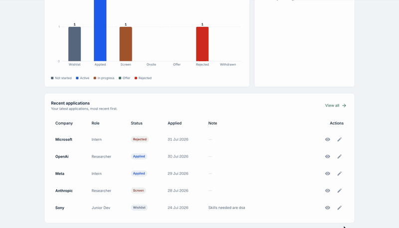
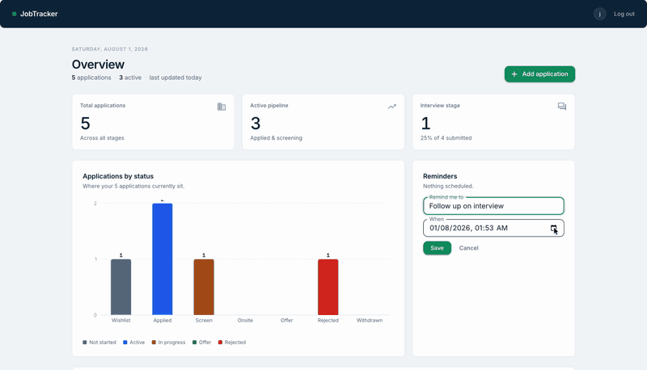

# JobTracker

A job-application tracker: log the roles you have applied for, move them through
a pipeline of statuses, and see where things stand on a dashboard.

FastAPI + Postgres on the backend, React + MUI on the front. Each user only ever
sees their own applications, enforced both in the service layer and by a Postgres
row-level-security policy.

---

## What it looks like

### Logging an application

Company, role, status, source URL and the date applied. Status starts wherever
you are in the process — `wishlist` for something you have not sent yet.



### Editing and deleting

Status and note are editable inline from the dashboard table, without opening the
application. The full form and delete live on the application's own page.



### Browsing and filtering

The full list filters by status, free-text company or role search, and an
applied-date range, all combinable.



### Scheduling a reminder

Reminders are picked up by a background scanner, published to RabbitMQ and
emailed by a separate worker — see
[How reminders get delivered](#how-reminders-get-delivered).



---

## Stack

| Layer | Choice |
| --- | --- |
| API | FastAPI, SQLModel, async SQLAlchemy, asyncpg |
| Database | PostgreSQL 17, migrated with Alembic |
| Auth | JWT (PyJWT), Argon2 hashing via pwdlib, Redis-backed logout blacklist |
| Reminders | RabbitMQ 4 + aio-pika, with a polling scanner and a consumer worker |
| Email | SMTP via aiosmtplib; Mailtrap sandbox in development |
| Frontend | React 19, TypeScript, MUI 9, Recharts, React Router 7, Vite |
| Packaging | uv (backend), npm (frontend), Docker Compose |

---

## Run it with Docker

Requires Docker with the Compose plugin. From the repo root:

```bash
cp env.docker.example env.docker
# fill in the CHANGE_ME values, then:
docker compose --env-file env.docker up --build
```

[env.docker.example](env.docker.example) is tracked; `env.docker` is gitignored,
so credentials stay out of version control. Six values are marked `CHANGE_ME`:

- `POSTGRES_PASSWORD`, `POSTGRES_ADMIN_PASSWORD`, `RABBITMQ_PASSWORD` — any
  values you like for local work; they are only used inside the network.
- `JWT_SECRET` — generate with `openssl rand -hex 32`.
- `MAIL_USERNAME`, `MAIL_PASSWORD` — from Mailtrap → Inboxes → SMTP Settings.
  Needed only for reminder *delivery*; the rest of the app runs without them.
  Left as placeholders, a due reminder is claimed and published but never sent,
  and the notifier logs `no SMTP credentials configured` and retries it.

Nothing else in the template needs editing for local development.

The `--env-file` flag is **required**. The stack does not read `.env`, so a bare
`docker compose up` stops with `required variable POSTGRES_ADMIN_USER is missing
a value: missing in env.docker` rather than starting something half-configured.
That message is the flag being absent, not a problem with `env.docker`.

To avoid repeating the flag, export it once per shell:

```bash
export COMPOSE_ENV_FILES=env.docker
docker compose up --build
```

Note that `COMPOSE_ENV_FILES` must be a real environment variable — setting it
*inside* a `.env` file does not work, because Compose has to know which files to
read before it can process one.

Then:

- App — <http://localhost:5173>
- API docs (Scalar) — <http://localhost:8000/scalar>
- OpenAPI schema — <http://localhost:8000/openapi.json>

Compose brings up eight services. `migrate` runs `alembic upgrade head` once and
exits; `backend` waits for it to finish successfully, and for Postgres and Redis
to pass their health checks, before it starts.

| Service | Image | Notes |
| --- | --- | --- |
| `postgres` | `postgres:17-alpine` | Data persists in the `postgres-data` volume |
| `redis` | `redis:7-alpine` | Persistence off — it only holds revoked-token JTIs |
| `rabbitmq` | `rabbitmq:4-management-alpine` | Management UI on host :15672; AMQP is not published |
| `migrate` | built from `backend/` | One-shot Alembic upgrade |
| `backend` | built from `backend/` | Uvicorn on :8000 |
| `reminder-scanner` | built from `backend/` | Polls for due reminders, publishes them |
| `reminder-notifier` | built from `backend/` | Consumes them and emails the owner |
| `frontend` | built from `frontend/` | Static bundle served by nginx on :80 → host :5173 |

Common operations (all assuming `COMPOSE_ENV_FILES` is exported, or
`--env-file env.docker` added):

```bash
docker compose up -d --build          # background
docker compose logs -f backend        # follow API logs
docker compose run --rm migrate alembic downgrade -1
docker compose down                   # stop, keep the database
docker compose down -v                # stop and wipe the database
```

### Configuration

`env.docker` is the single source of truth for the containers.
Compose reads it two ways, both pointed at the same file:

- as the substitution source for `${...}` in `docker-compose.yml` (host ports,
  the frontend build arg, the Postgres role remap), and
- as `env_file:` for the `backend` and `migrate` containers, which is why the
  compose file no longer restates every application variable.

Hostnames in it are service names (`postgres`, `redis`) because they are resolved
inside the compose network. `backend/.env` and `frontend/.env` still exist for
host-local runs and point at `localhost`; Compose deliberately ignores them.

### Overriding for a real deployment

Your `env.docker` is already untracked, so it can hold real credentials directly.
`env.docker.local` is for the case where you want to keep a working `env.docker`
and layer a few keys on top of it — pass both files:

```bash
docker compose --env-file env.docker --env-file env.docker.local up --build
# or: export COMPOSE_ENV_FILES=env.docker,env.docker.local   (comma-separated)
```

Pass **both**, in that order. Supplying only the override to `--env-file` changes
`${...}` substitution but not the container variables, which is how you get a
frontend published on a new port while `FRONTEND_ORIGIN` still names the old one
— and then CORS rejects every request. The `env_file:` list in
`docker-compose.yml` already includes `env.docker.local` as optional, so the two
mechanisms agree as long as both files are passed.

### `VITE_API_URL` is a build arg, not a runtime variable

Vite inlines env vars at *build* time, so the value is injected through a
Docker `ARG` and baked into the bundle. Two consequences:

- changing it requires `docker compose build frontend`, not just a restart;
- it must be reachable from the **browser** — `http://localhost:8000`, not
  `http://backend:8000`.

Likewise, if you change `FRONTEND_PORT`, change `FRONTEND_ORIGIN` to match or the
API's CORS policy will reject the app.

### Port conflicts

The defaults are 8000 and 5173 — the same ports `uvicorn --reload` and
`npm run dev` use. If you have those running on the host, set `BACKEND_PORT`,
`FRONTEND_PORT`, `FRONTEND_ORIGIN` and `VITE_API_URL` in `env.docker.local`.

### Two database roles, on purpose

`docker-compose.yml` wires up two Postgres roles:

- **`POSTGRES_ADMIN_USER`** owns the schema and runs migrations.
- **`POSTGRES_USER`** is what the API connects as, and is deliberately
  unprivileged.

This split is what makes row-level security real. Postgres exempts superusers
from RLS entirely, and a table's owner is only subject to a policy because the
`enable_rls` migration sets `FORCE ROW LEVEL SECURITY`. Running the API as the
owning or admin role would leave `application_owner_isolation` doing nothing.
The app role is created on first startup by
[infra/postgres/init-app-user.sh](infra/postgres/init-app-user.sh), which the
Postgres image runs from its init directory — it only fires when the data volume
is empty, so change the app password and you will want a `docker compose down -v`.

### How reminders get delivered

Two extra containers run alongside the API, both from the same image with a
different command:

| Service | Command | Job |
| --- | --- | --- |
| `reminder-scanner` | `python -m app.workers.scanner` | Polls for due reminders, publishes them to RabbitMQ |
| `reminder-notifier` | `python -m app.workers.notifier` | Consumes them and emails the owner |

The scanner claims work with a single statement:

```sql
UPDATE reminder SET status = 'queued', claimed_at = now(), attempt_count = attempt_count + 1
WHERE id IN (SELECT id FROM reminder
             WHERE status = 'pending' AND remind_at <= now()
             ORDER BY remind_at LIMIT :batch
             FOR UPDATE SKIP LOCKED)
RETURNING ...
```

Because the `UPDATE` is also what selects, a reminder can only leave `pending`
once, so two scanners cannot both publish it. `SKIP LOCKED` means the losing
scanner steps over rows already claimed rather than blocking on them. Both
workers are therefore safe to scale:

```bash
docker compose --env-file env.docker up -d --scale reminder-scanner=3
```

**Delivery is at-least-once, deliberately.** The claim commits *before* the
publish, so a crash in between leaves a reminder marked `queued` that no message
went out for. A reaper in each scan returns those to `pending` once
`REMINDER_LEASE_SECONDS` has passed, and abandons them as `failed` after
`REMINDER_MAX_ATTEMPTS`. Publishing first would risk sending a reminder twice
with no record of it, which is the harder failure to live with. The consequence
is that the notifier must tolerate seeing the same reminder twice — it does,
because `mark_delivered` only acts on rows still in `queued`.

Failed deliveries are rejected to `reminders.notify.dead` rather than requeued,
which would hot-loop. The dead-letter queue is a diagnostic record, not the retry
mechanism — the lease reaper is what retries.

The workers connect as **`POSTGRES_ADMIN_USER`**, not the app role. A scanner
works across all owners, so it has no single `app.current_user_id` to set, and
the RLS policy would match nothing. Note how that fails: not with an error, but
with every scan reporting zero due reminders.

#### The email itself

The notifier resolves the recipient from `owner_id` at delivery time rather than
taking an address off the message. That keeps addresses out of the broker, and
means someone who changes their email between the scan and the send gets the mail
at the new one.

Failures are classified before the reminder state machine sees them, because the
two cases are handled oppositely — see `_classify` in
[backend/app/services/email.py](backend/app/services/email.py):

| Failure | Treated as | Why |
| --- | --- | --- |
| Recipient refused, or any other 5xx | permanent → `failed` | The address is wrong; retrying cannot fix it |
| 4xx, timeout, connection error | transient → retried | The server asked us to come back later |
| **Bad credentials (5xx)** | transient → retried | An operator mistake affecting *every* reminder. Permanent would mark the whole backlog `failed` with no way back |
| **Sender refused** | transient → retried | A wrong `MAIL_FROM` is configuration, not a bad reminder |

Those last two are the exceptions to SMTP's own 4xx/5xx rule, and they are the
reason this is a function with tests rather than three inline lines.

Two consequences worth knowing. A duplicate message on the queue means a
duplicate email: `mark_delivered` stops the *bookkeeping* running twice, but it
runs after the send. And cancelling a reminder after the scanner has published it
cannot unsend the mail — the row ends up `cancelled` but the email still goes out.

Times in the email are labelled UTC because nothing stores the user's timezone.

> `MAIL_SERVER=sandbox.smtp.mailtrap.io` is Mailtrap's **sandbox**. It captures
> every message in your Mailtrap inbox and delivers to nobody, which is what you
> want in development — but it means "delivered" in the logs is not proof that a
> real inbox received anything. Switch to a live sending host before you rely on
> it.

> One operational note: a migration that drops and recreates the
> `reminderstatus` enum changes its type OID, and asyncpg caches OIDs per
> connection. Workers holding pooled connections through such a migration log
> `cache lookup failed for type <oid>` until the pool recycles. Restart them
> after that kind of migration. The scan loop survives it either way — a failed
> tick is logged and the next one continues.

---

## Run it locally, without Docker

Postgres and Redis need to be reachable on the ports in `backend/.env`.

**Backend** (needs [uv](https://docs.astral.sh/uv/)):

```bash
cd backend
cp example.env .env       # then edit
uv sync
uv run alembic upgrade head
uv run uvicorn app.main:app --reload
```

**Frontend** (Node 20+):

```bash
cd frontend
cp example.env .env
npm install
npm run dev               # http://localhost:5173
```

---

## Tests

```bash
cd backend
uv run pytest
```

The suite needs neither Postgres nor Redis — it runs against in-memory SQLite
with Redis monkeypatched, in a few seconds. See
[backend/tests/README.md](backend/tests/README.md) for layout and for the
deliberate gaps (notably: the RLS policy is a Postgres feature and is inert
under SQLite, so the ownership tests assert on the service layer instead).

The frontend has no test runner configured.

---

## Layout

```
backend/
  app/
    main.py               FastAPI app, CORS, Scalar docs
    config.py             pydantic-settings, split into DB and security settings
    core/security.py      bearer scheme
    database/
      models/             SQLModel tables: user, application, status history, reminder
      session.py          async engine; user_scoped_session sets app.current_user_id for RLS;
                          admin_session_factory for the workers, which bypass RLS
      redis.py            JWT blacklist
    routers/              HTTP layer + dependency wiring
    schemas/              request/response models
    services/             business logic
                          reminder_dispatch.py is worker-side and not user-scoped
                          email.py wraps SMTP and classifies failures as permanent or not
    workers/
      scanner.py          polls for due reminders, publishes to RabbitMQ
      notifier.py         consumes and emails the owner; compose() builds the message
      broker.py           connection, topology, message shape
      runtime.py          logging and SIGTERM handling
    utils.py              JWT encode/decode
  migrations/             Alembic revisions, including enable_rls
  tests/
frontend/
  src/
    api/                  axios instance, auth + application + reminder clients
    components/           table, filters, form, charts, reminders panel, layout, route guards
    contexts/             AuthContext
    pages/                home, login, signup, dashboard, application CRUD
    theme.ts              MUI theme
infra/postgres/           first-run database bootstrap
docker-compose.yml
```

---

## API

All routes except registration and login require `Authorization: Bearer <token>`.

### `/user`

| Method | Path | Purpose |
| --- | --- | --- |
| POST | `/user/register` | Create an account |
| POST | `/user/login` | Exchange credentials for a JWT |
| POST | `/user/logout` | Blacklist the current token's `jti` in Redis until it expires |

### `/application`

| Method | Path | Purpose |
| --- | --- | --- |
| POST | `/application/` | Create |
| GET | `/application/?id=` | Fetch one |
| GET | `/application/all` | List — paginated, filterable by `status` (repeatable), `search`, `applied_from`, `applied_to` |
| GET | `/application/stats` | Totals and per-status counts |
| GET | `/application/status?application_status=` | All applications in one status |
| GET | `/application/recent` | Most recent applications |
| GET | `/application/history?id=` | Status-change history |
| PATCH | `/application/?id=` | Full update |
| PATCH | `/application/status?id=` | Change status (also appends to history) |
| PATCH | `/application/note?id=` | Update the note |
| DELETE | `/application/?application_id=` | Delete |

Statuses: `wishlist`, `applied`, `screen`, `onsite`, `offer`, `rejected`,
`withdrawn`.

### `/reminder`

| Method | Path | Purpose |
| --- | --- | --- |
| POST | `/reminder/` | Create — `remind_at` must be in the future and carry a timezone offset |
| GET | `/reminder/?id=` | Fetch one |
| GET | `/reminder/all` | List — paginated, filterable by `status` (repeatable) and `due_before` |
| GET | `/reminder/upcoming?limit=` | Next few still-pending reminders |
| PATCH | `/reminder/?id=` | Edit content or time — 409 once it is no longer `pending` |
| DELETE | `/reminder/?id=` | Soft delete to `cancelled`; idempotent |

Statuses: `pending` → `queued` → `delivered`, with `failed` and `cancelled` as
terminal states. Only `pending` is editable, and only the workers ever set
anything other than `pending` or `cancelled` — `status`, `attempt_count` and
`claimed_at` are absent from every write schema.

Deleting is a soft delete on purpose: a hard delete would strand any message the
scanner had already published, leaving the notifier to look up a row that no
longer exists.

---

## Configuration

Three separate files, by intent:

| File | Used by | Tracked |
| --- | --- | --- |
| `env.docker.example` | template to copy | yes — placeholders only |
| `env.docker` | Docker Compose (both substitution and container env) | no |
| `env.docker.local` | optional Compose overrides | no |
| `backend/.env`, `frontend/.env` | host-local runs, from `example.env` | no |

Compose does not read `.env`, `backend/.env` or `frontend/.env`: those point at
`localhost`, which is wrong inside a container.

| Variable | Used by | Notes |
| --- | --- | --- |
| `POSTGRES_DB` | both | Database name |
| `POSTGRES_USER` / `POSTGRES_PASSWORD` | both | Unprivileged application role |
| `POSTGRES_ADMIN_USER` / `POSTGRES_ADMIN_PASSWORD` | both | Schema owner; used by Alembic |
| `POSTGRES_SERVER` / `POSTGRES_PORT` | backend | `postgres` / `5432` under Compose |
| `POSTGRES_POOL_SIZE` / `POSTGRES_POOL_PRE_PING` | backend | Connection pool |
| `REDIS_HOST` / `REDIS_PORT` | backend | `redis` / `6379` under Compose |
| `RABBITMQ_HOST` / `RABBITMQ_PORT` | workers | `rabbitmq` / `5672` under Compose |
| `RABBITMQ_USER` / `RABBITMQ_PASSWORD` | both | Broker credentials; also seed the image's default user |
| `RABBITMQ_MANAGEMENT_PORT` | compose | Host port for the management UI |
| `REMINDER_POLL_INTERVAL` | scanner | Seconds between scans; also a reminder's worst-case lateness |
| `REMINDER_BATCH_SIZE` | scanner | Reminders claimed per scan |
| `REMINDER_LEASE_SECONDS` | scanner | How long a claim is trusted before it is reaped |
| `REMINDER_MAX_ATTEMPTS` | scanner | Claims before a reminder is abandoned as `failed` |
| `REMINDER_PREFETCH` | notifier | Messages one consumer holds at a time |
| `MAIL_SERVER` / `MAIL_PORT` | notifier | SMTP host; `sandbox.smtp.mailtrap.io` / `2525` in development |
| `MAIL_USERNAME` / `MAIL_PASSWORD` | notifier | SMTP credentials. Wrong ones retry rather than fail permanently |
| `MAIL_FROM` / `MAIL_FROM_NAME` | notifier | The `From:` header |
| `MAIL_START_TLS` / `MAIL_SSL_TLS` | notifier | STARTTLS for 587/2525, implicit TLS for 465. Set one, never both |
| `MAIL_TIMEOUT` | notifier | Seconds per send; keep it under `REMINDER_LEASE_SECONDS` |
| `JWT_SECRET` | backend | Required, no default |
| `JWT_ALGORITHM` | backend | `HS256` |
| `ACCESS_TOKEN_EXPIRE_MINUTES` | backend | Default 60 |
| `FRONTEND_ORIGIN` | backend | The single allowed CORS origin |
| `VITE_API_URL` | frontend | Build arg, inlined into the bundle |
| `BACKEND_PORT` / `FRONTEND_PORT` | compose | Host ports |

---

## Before deploying this anywhere real

The Docker setup targets local development. It is not hardened:

- `POSTGRES_POOL_SIZE` aside, the SQLAlchemy engine runs with `echo=True`, so
  every statement is logged.
- The backend container listens on plain HTTP with no reverse proxy or TLS in
  front of it.
- There is no rate limiting on the login endpoint.
- Email goes to a Mailtrap sandbox inbox, so no reminder reaches a real address.
  Nothing verifies that a registered email belongs to the person who typed it,
  which a live sending host would make an abuse vector.
- Two known behaviours are pinned by tests rather than fixed:
  `PATCH /application/` rejects partial updates, and `GET /application/history`
  performs no ownership check.
